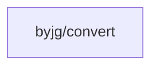

# Convert

[](https://github.com/byjg/php-convert/actions/workflows/phpunit.yml) 
[](http://opensource.byjg.com)
[](https://github.com/byjg/php-convert/) 
[](https://opensource.byjg.com/opensource/licensing.html) 
[](https://github.com/byjg/php-convert/releases/)

A lightweight utility for string conversion between text from UTF8 to various formats and vice-versa. Supports HTML entities, MIME encoded words, accents removal, emoji conversion, and more.

## Features

- Convert HTML entities to UTF8 and vice-versa
- Convert ASCII emoticons to emoji characters
- Handle combining characters
- Remove accents from UTF8 text
- Convert text to MIME encoded words (RFC 2047)
- Remove emoji characters
- Convert to ASCII-only text
- Email-safe ISO-8859-1 conversion

## Examples

```php
<?php
// Convert HTML entities to UTF8
$str = \ByJG\Convert\ToUTF8::fromHtmlEntities('Jo&atilde;o');
echo $str; // João

// Convert UTF8 to HTML entities
$str2 = \ByJG\Convert\FromUTF8::toHtmlEntities('João');
echo $str2; // Jo&atilde;o

// Remove accents
$str3 = \ByJG\Convert\FromUTF8::removeAccent('João');
echo $str3; // Joao

// Convert to MIME encoded word
$str4 = \ByJG\Convert\FromUTF8::toMimeEncodedWord('João');
echo $str4; // =?utf-8?Q?Jo=C3=A3o?=

// Convert to ASCII only
$str5 = \ByJG\Convert\FromUTF8::onlyAscii('João');
echo $str5; // Joao

// Handle combining characters
$str6 = \ByJG\Convert\ToUTF8::fromCombiningChar($combining);
echo $str6; // Converts combining characters to proper UTF8

// Convert ASCII emoticons to emoji
$str7 = \ByJG\Convert\ToUTF8::fromEmoji('Hello :) How are you? :D');
echo $str7; // Hello 😊 How are you? 😃

// More complex emoticon examples
$str8 = \ByJG\Convert\ToUTF8::fromEmoji('I love you <3 but my heart is </3');
echo $str8; // I love you ❤️ but my heart is 💔

// Remove emoji characters
$str9 = \ByJG\Convert\FromUTF8::removeEmoji('Hello 👋 World 🌍');
echo $str9; // Hello World
```

### Supported Emoticons

The `fromEmoji` method supports a wide range of ASCII emoticons including:

- Basic smileys: `:)` `:-)` `:D` `:-D` `:(` `:-(` `;)` `;-)`
- Emotions: `XD` `:O` `:-O` `:o` `>:(` `:3` `:*` `:')`
- Hearts: `<3` `</3`
- Special faces: `O:)` `>:)` `:S` `:$` `:@` `:|` `:X`
- Eastern style: `-_-` `^_^` `>_<` `._.'`
- Actions: `\o/` `o/` `\o`

## Install

Just type:

```bash
composer require "byjg/convert"
```

## Running Tests

```bash
vendor/bin/phpunit
```

## Dependencies



----  
[Open source ByJG](http://opensource.byjg.com)
