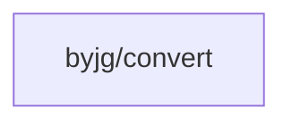

# Convert

[](https://github.com/byjg/php-convert/actions/workflows/phpunit.yml) 
[](http://opensource.byjg.com)
[](https://github.com/byjg/php-convert/) 
[](https://opensource.byjg.com/opensource/licensing.html) 
[](https://github.com/byjg/php-convert/releases/)

A lightweight utility for string encoding conversion between UTF-8 and various formats. The library provides two main classes:

- `ToUTF8`: Convert text from various formats to UTF-8
- `FromUTF8`: Convert UTF-8 text to various formats or manipulate UTF-8 strings

## Features

### ToUTF8 Class

- `fromHtmlEntities`: Convert HTML entities to UTF-8 characters
- `fromCombiningChar`: Convert combining characters to UTF-8

### FromUTF8 Class

- `toHtmlEntities`: Convert UTF-8 characters to HTML entities
- `removeAccent`: Remove accents from UTF-8 characters (é → e)
- `onlyAscii`: Keep only ASCII characters, removing or replacing all others
- `toIso88591Email`: Encode UTF-8 text for use in email headers (ISO-8859-1 format)
- `toMimeEncodedWord`: Modern replacement for toIso88591Email using UTF-8 and MIME encoding
- `removeEmoji`: Remove emoji characters from UTF-8 text

## Examples

```php
<?php
// Convert HTML entities to UTF-8
$str = \ByJG\Convert\ToUTF8::fromHtmlEntities('Jo&atilde;o');
echo $str; // João

// Convert UTF-8 to HTML entities
$str2 = \ByJG\Convert\FromUTF8::toHtmlEntities('João');
echo $str2; // Jo&atilde;o

// Remove accents from UTF-8 text
$str3 = \ByJG\Convert\FromUTF8::removeAccent('João');
echo $str3; // Joao

// Encode for email headers (ISO-8859-1)
$str4 = \ByJG\Convert\FromUTF8::toIso88591Email('João');
echo $str4; // =?iso-8859-1?Q?Jo=E3o?=

// Modern MIME encoding for email headers (UTF-8)
$str5 = \ByJG\Convert\FromUTF8::toMimeEncodedWord('João');
echo $str5; // =?utf-8?Q?Jo=C3=A3o?=

// Keep only ASCII characters
$str6 = \ByJG\Convert\FromUTF8::onlyAscii('João');
echo $str6; // Joao

// Convert combining characters to UTF-8
$combining = 'Joa\xCC\x83o'; // João with combining tilde
$str7 = \ByJG\Convert\ToUTF8::fromCombiningChar($combining);
echo $str7; // João

// Remove emoji
$str8 = \ByJG\Convert\FromUTF8::removeEmoji('Hello 👋');
echo $str8; // Hello
```

## Install

Just type:

```bash
composer require "byjg/convert"
```

## Running Tests

```bash
vendor/bin/phpunit
```

## Dependencies



----  
[Open source ByJG](http://opensource.byjg.com)
