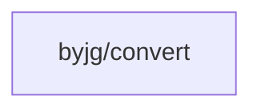

# String Conversion Utility

[](https://github.com/sponsors/byjg)
[](https://github.com/byjg/php-convert/actions/workflows/phpunit.yml)
[](http://opensource.byjg.com)
[](https://github.com/byjg/php-convert/)
[](https://opensource.byjg.com/opensource/licensing.html)
[](https://github.com/byjg/php-convert/releases/)

A lightweight utility for string conversion between text from UTF8 to various formats and vice-versa. Supports HTML entities, MIME encoded words, accents removal, emoji conversion, and more.

## Features

- Convert HTML entities to UTF8 and vice-versa
- Convert ASCII emoticons to emoji characters
- Handle combining characters
- Remove accents from UTF8 text
- Convert text to MIME encoded words (RFC 2047)
- Remove emoji characters
- Convert to ASCII-only text

## Documentation

- [Converting to UTF8](docs/converting-to-utf8.md) - Convert from HTML entities, emoticons, and combining characters
- [Converting from UTF8](docs/converting-from-utf8.md) - Convert to HTML entities, remove accents and emoji, ASCII conversion
- [Installation](docs/installation.md) - How to install and set up the library
- [Examples](docs/examples.md) - Real-world usage examples and common patterns

## Quick Start

```php
<?php
// Convert HTML entities to UTF8
$str = \ByJG\Convert\ToUTF8::fromHtmlEntities('Jo&atilde;o');
echo $str; // João

// Convert UTF8 to HTML entities
$str2 = \ByJG\Convert\FromUTF8::toHtmlEntities('João');
echo $str2; // Jo&atilde;o

// Remove accents
$str3 = \ByJG\Convert\FromUTF8::removeAccent('João');
echo $str3; // Joao

// Convert to MIME encoded word (for email headers)
$str4 = \ByJG\Convert\FromUTF8::toMimeEncodedWord('João');
echo $str4; // =?utf-8?Q?Jo=C3=A3o?=

// Convert to ASCII only
$str5 = \ByJG\Convert\FromUTF8::onlyAscii('João');
echo $str5; // Joao

// Convert ASCII emoticons to emoji
$str6 = \ByJG\Convert\ToUTF8::fromEmoji('Hello :) How are you? :D');
echo $str6; // Hello 😊 How are you? 😃

// Remove emoji characters
$str7 = \ByJG\Convert\FromUTF8::removeEmoji('Hello 👋 World 🌍');
echo $str7; // Hello  World
```

For more examples and detailed documentation, see the [Examples](docs/examples.md) page.

## Install

Just type:

```bash
composer require "byjg/convert"
```

## Running Tests

```bash
vendor/bin/phpunit
```

## Dependencies



----  
[Open source ByJG](http://opensource.byjg.com)
